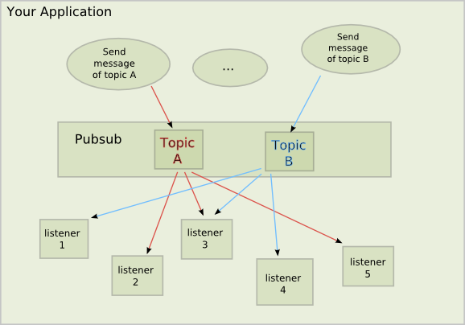

.. PyPubSub documentation master file, created by
   sphinx-quickstart on Mon May 20 21:24:10 2013.

Welcome to PyPubSub's Home Page!
================================

This is the documentation for the PyPubSub project. This Python project defines
a package called 'pypubsub' which provides a publish-subscribe API to facilitate

1. event-based programming
2. decoupling an application's in-memory components

PyPubSub provides the infrastructure for using the Observer pattern in your
single-process application. It is pure Python and works on Python 3.3+.

Using the Observer pattern in your single-process application can dramatically
simplify its design and improve testability.
The Observer allows code to observe "messages", without knowing anything about the source of
the message (which Python object or function), and in turn allows code to emit messages
without any regard for which code will receive the message (it may not be received at all),
what the receiving code will do with the message, etc.
Basically the Observer pattern is like a radio broadcast, it is a one-way message sent,
the only contract is in the message content: the receiver/listener must have the ability
to decode the message.

A classic example where PyPubSub could be useful: a GUI application. How do components like
views and dialogs communicate their changes to one another? Without a publish-subscribe
mechanism, the code can become a real spaghetti.

PyPubSub makes it easy for your code to emit messages, and other code, in the same process,
to receive those messages. PyPubSub takes care of the plumbing.

The Publish-Subscribe API provided by PyPubSub has the following characteristics:

1. Message Sender: The sender of a PyPubSub message is the ccode that calls pub.sendMessage().
2. Message Topic: 
   a. Every message is specific to a "topic", defined as a string name;
   b. Topics form a hierarchy. A parent topic is more generic than a child topic.
3. Message Data: any keyword arguments used by the sender, pub.sendMessage(topic, \**data);

   a. A topic may have no associated message data, or may have any mixture of required
      and optional data; this is known as its Message Data Specification (MDS);
   b. The MDS of a child topic cannot be more restrictive than that of a parent topic;
   c. Once the MDS is set for a topic, it never changes during the runtime of an application.

4. Message Listener: All message listeners are callables that get registered with PyPubSub
   in order to receive messages of a given topic, and must have a signature that is
   compatible with the topic's MDS.
5. Message Delivery:

   a. Messages sent will be delivered to all registered listeners of a given topic; this
      includes listeners of the topic, parent topic, etc. Hence the root of all topics
      (called ALL_TOPICS) receives all messages.
   b. Sequence of delivery is unspecified and can change at any time. This is fundamental
      to the Observer pattern, and your application's listeners must be designed to not depend
      on the order in which they receive a given message.
   c. Messages are delivered synchronously: a listener must return or throw an exception
      before the message is delivered to the next listener.
   d. A listener that raises an exception does not prevent remaining listeners from
      receiving the message.
   e. A message sent will be delivered to all registered listeners of the specified topic
      before control is returned to the sender.

6. Message Immutability: message contents must be left unchanged by listeners, but PyPubSub
   does not verify this.
7. Message Direction: a message is one-way from sender to set-of-listeners; PyPubSub does not
   support "answering" with a response from each listener to the sender. This could, of course,
   be achieved by having the sender include a callback as message data, and each listener
   calling that callback with agreed-upon data, but this (typically) increases coupling.
8. Message Source: PyPubSub does not provide any information to the listeners regarding the
   origin (aka source, or provenance) of a message. The sender could, of course, include such
   information with the message data, but this is *not* recommended as it defeats the purpose
   of the Observer pattern.

Here is a schematic representation of the role of PyPubSub during message sending and delivery:

..

PyPybSub was originally written by Robb Shecter as wx.lib.pubsub in wxPython 2.x, sometime
around y2k. Robb and the wxPython author, Robin Dunn, allowed me to take over the package around
2003, and I moved it out into a standalone package (no dependencies on wxPython) around 2006
with their approval. I hosted the code on SourceForget.net for about 10 years, then moved it to
github sometime in 2016. The code is very mature and stable. See :ref:`label-history` for
details on its history and :ref:`label-roadmap` for possible future work.

Contents:

.. toctree::
   :maxdepth: 2

   about
   installation
   usage/index
   development/dev_index

   
Indices and tables
==================

* :ref:`genindex`
* :ref:`modindex`
* :ref:`search`

